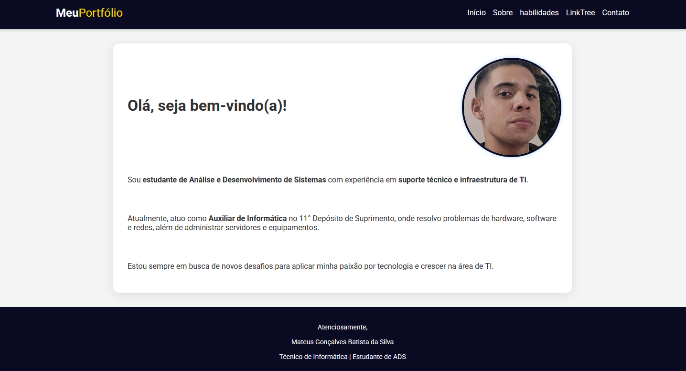

# Portfólio

## 📚 Projeto de Faculdade
Projeto desenvolvido durante as aulas do curso, aplicando conhecimentos de **HTML e CSS** para formaturação e estilização.



## 🚀 Descrição
Site estático desenvolvido com:
- **HTML5** para estruturação do conteúdo
- **CSS3** para estilização e layout responsivo

## 🔧 Instruções de Uso

### Acesso Online
O projeto está hospedado no Vercel:  
🔗 [portfolio-rho-seven-71.vercel.app](https://portfolio-rho-seven-71.vercel.app/)

### Execução Local
1. Clone o repositório:
   ```bash
   git clone https://github.com/seu-usuario/seu-repositorio.git

📄 Licença

Este projeto está licenciado sob a MIT License - veja o arquivo <a href="license.text">License</a> para detalhes.